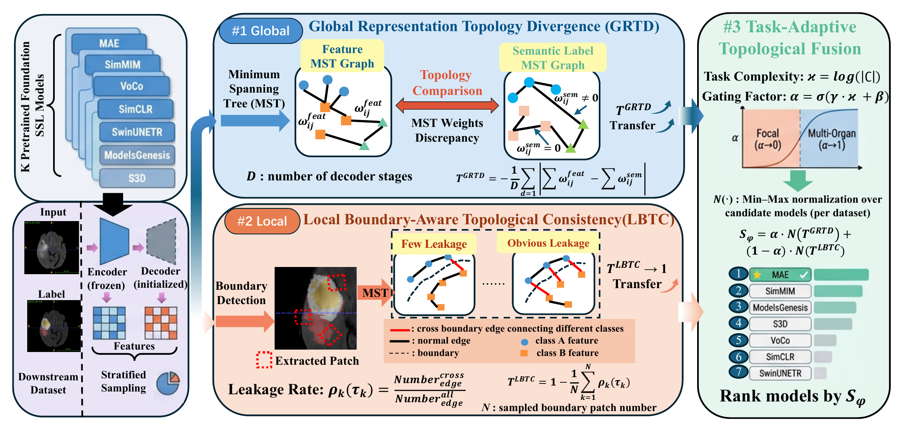

# Topology-Driven Transferability Estimation for Medical SSL Models

Welcome! This repository provides the official implementation of **Topology-Driven Transferability Estimation of Medical Foundation Models**. 

> 📢 **Update**: 
> - **Conference Version**: The initial version of this work focusing on segmentation transferability has been accepted at **MICCAI 2026** [[1]](https://arxiv.org/html/2602.23916).
> - **Journal Extension (Under Review)**: We have extended this framework to support joint segmentation and classification transferability estimation, we also further introduce more robust branch fusion, weighted layer sampling, etc. 
> 

## Model Framework



> Selecting the best medical foundation model is highly task-dependent. Instead of fine-tuning every candidate model, this repository estimates transferability from the geometry of frozen representations. The framework combines **Global Representation Topology Divergence (GRTD)**, **Local Boundary-Aware Topological Consistency (LBTC)**, and **Task-Adaptive Topological Fusion** to rank pretrained OpenMind-style SSL models for a target medical imaging task.

## Foundation model resources used in this project

This repository follows the dataset/model setting of **An OpenMind for 3D medical vision self-supervised learning**. The original OpenMind benchmark releases a large-scale 3D MRI pretraining dataset, standardized pretrained checkpoints, and the corresponding SSL/fine-tuning codebases.

| Resource | Link |
|---|---|
| OpenMind pretraining dataset | [AnonRes/OpenMind on Hugging Face](https://huggingface.co/datasets/AnonRes/OpenMind) |
| OpenMind pretrained model collection | [MIC-DKFZ/OpenMind Models on Hugging Face](https://huggingface.co/collections/MIC-DKFZ/openmind-models) |

## Downstream datasets

The main paper setting evaluates transferability on six OpenMind downstream segmentation tasks: four in-distribution head-and-neck/brain MRI tasks and two out-of-distribution tasks.

| ID | Dataset | Task / anatomy | Link |
|---|---|---|---|
| ISL | ISLES 2022 | Stroke lesion segmentation on DWI/ADC/FLAIR MRI | [ISLES Grand Challenge](https://isles22.grand-challenge.org/) |
| HNT | HNTS-MRG 2024 | Head-and-neck tumor segmentation on MR | [Challenge page](https://hntsmrg24.grand-challenge.org/) / [Zenodo data](https://zenodo.org/records/11199559) |
| MSF | MS FLAIR | Multiple-sclerosis lesion segmentation on brain MRI | [Data article](https://www.sciencedirect.com/science/article/pii/S235234092200347X) |
| TPC | ToP-CoW / TopCoW | Circle of Willis vessel segmentation | [Grand Challenge](https://topcow23.grand-challenge.org/) / [paper](https://arxiv.org/abs/2312.17670) |
| ACD | ACDC | Cardiac structure segmentation on cine-MRI | [ACDC Challenge](https://www.creatis.insa-lyon.fr/Challenge/acdc/) |
| KIT | KiTS19 | Kidney and kidney-tumor segmentation on CT | [KiTS19 Grand Challenge](https://kits19.grand-challenge.org/) / [official GitHub](https://github.com/neheller/kits19) |

Datasets are not redistributed here. Please download each dataset from its official source and organize your paths through the JSON files under `DataLists/` and `Configs/`.

## Repository structure

```text
TopoTE/
├── Configs/                         # Experiment configuration files
├── DataLists/                       # Dataset list JSON files
├── Models/                          # Local model definitions
├── assets/                          # README / paper figures
│   ├── figure_1.png
│   └── figure_1.pdf
├── nnssl-openneuro/                 # Bundled OpenMind/nnSSL reference codebase
├── preprocessed/                    # Dataset conversion and preprocessing scripts
├── utils/                           # Metrics, feature loading, ranking, and sampling utilities
├── extract_features.py              # Batch checkpoint feature extraction
├── extract_features_only.py         # Single-model feature extraction
├── main_unified_with_classification.py
├── rank_metrics.py                  # Weighted Kendall and correlation utilities
├── run_unified_with_classification_timed.py
├── requirements.txt
└── README.md
```

## Get started

### Environment preparation

Create a clean Python environment first. The bundled `nnssl-openneuro` package declares Python `>=3.12`; use Python 3.12 when possible.

```bash
conda create -n TopoTE python=3.12 -y
conda activate TopoTE
pip install --upgrade pip
pip install -r requirements.txt
```

If you need a CUDA-specific PyTorch build, install PyTorch from the official selector first, then install the remaining dependencies:

```bash
pip install torch torchvision --index-url https://download.pytorch.org/whl/cu121
pip install -r requirements.txt
```

### Dataset preparation

Segmentation data lists should provide image and segmentation paths:

```json
{
  "val": [
    {
      "data": "/path/to/image.nii.gz",
      "seg": "/path/to/label.nii.gz"
    }
  ]
}
```

Classification data lists should provide image paths and image-level labels:

```json
{
  "val": [
    {
      "data": "/path/to/image.nii.gz",
      "label": 0
    }
  ]
}
```

## Feature extraction


> **Entrypoint note.** `extract_features_only.py` is the canonical single-model extractor. The previous duplicate under `utils/` has been removed to avoid ambiguous maintenance and import behavior. `extract_features.py` now discovers the root-level extractor by default, or you can override it with `--extractor`.

Extract features for one checkpoint:

```bash
python extract_features_only.py \
  --cfg Configs/ResEncl/MSF1.json \
  --data_list_file DataLists/MSF.json \
  --model_path /path/to/checkpoint.pth \
  --model_name ResEncL-OpenMind-MAE \
  --feature_save_dir ./features/MSF/ResEncL-OpenMind-MAE \
  --device cuda \
  --num_workers 4
```

Batch-extract features for all checkpoints under a directory:

```bash
python extract_features.py \
  --ckpt_dir /path/to/checkpoints \
  --cfg Configs/ResEncl/MSF1.json \
  --data_list_file DataLists/MSF.json \
  --output_root ./features/MSF \
  --device cuda \
  --bg_sample_num 2560
```

## Running transferability metrics

Run the unified evaluation script directly from checkpoint/model loading:

```bash
python run_unified_with_classification_timed.py \
  --cfg Configs/ResEncl/MSF1.json \
  --data_list_file DataLists/MSF.json \
  --out_csv ./results/rank_msf.csv \
  --metric tda_adaptive \
  --device cuda
```

Run from precomputed feature files when available:

```bash
python run_unified_with_classification_timed.py \
  --cfg Configs/ResEncl/MSF1.json \
  --data_list_file DataLists/MSF.json \
  --feature_source pkl \
  --pkl_root ./features/MSF \
  --out_csv ./results/rank_msf_pkl.csv \
  --metric tda_adaptive
```

Common metric options are registered in `utils/metric_registry.py`. The main topology-aware options include TDA/LBTC-style local topology, global representation divergence, and task-adaptive fusion.

## Ranking evaluation

After generating a ranking CSV, compute weighted Kendall correlation against OpenMind-style ground truth:

```bash
python rank_metrics.py \
  --csv ./results/rank_msf.csv \
  --dataset MSF \
  --model_col model_name \
  --score_col fused_score
```

Use `--ascending` if lower metric values should be ranked better.

## Preprocessing scripts

Dataset conversion scripts are under `preprocessed/`. They provide utilities for converting common medical-imaging datasets into nnU-Net-style folders and generating compatible data lists/configurations.

Example:

```bash
python preprocessed/prepare_MS_FLAIR_to_nnunet.py \
  --ms_root /path/to/MS_FLAIR \
  --ccfv_root /path/to/TopoTE \
  --dataset_id 11
```

## Notes

- Large datasets, checkpoints, extracted features, and result CSVs are intentionally not included in this repository archive.
- The codebase has been cleaned so Python source files no longer contain Chinese comments. Runtime messages and CLI help strings have also been converted to English for consistency.
- `requirements.txt` is the standard dependency file. A duplicate `requirement.txt` is included for compatibility with the requested filename.
- The bundled `nnssl-openneuro/` directory is kept as an OpenMind/nnSSL reference dependency. Please follow its original license and citation requirements when using it.

## Acknowledgement

This project builds on the OpenMind benchmark. We thank the OpenMind authors for releasing the dataset, checkpoints, and framework for reproducible 3D medical SSL research. If you use this repository, please cite the corresponding paper once available. If you use OpenMind data, pretrained checkpoints, or nnSSL code, please also cite the OpenMind paper:

```bibtex
@inproceedings{wald2025openmind,
  title={An OpenMind for 3D Medical Vision Self-supervised Learning},
  author={Wald, Tassilo and Ulrich, Constantin and Suprijadi, Jonathan and Ziegler, Sebastian and Nohel, Michal and Peretzke, Robin and Kohler, Gregor and Maier-Hein, Klaus H.},
  booktitle={Proceedings of the IEEE/CVF International Conference on Computer Vision},
  year={2025}
}
```